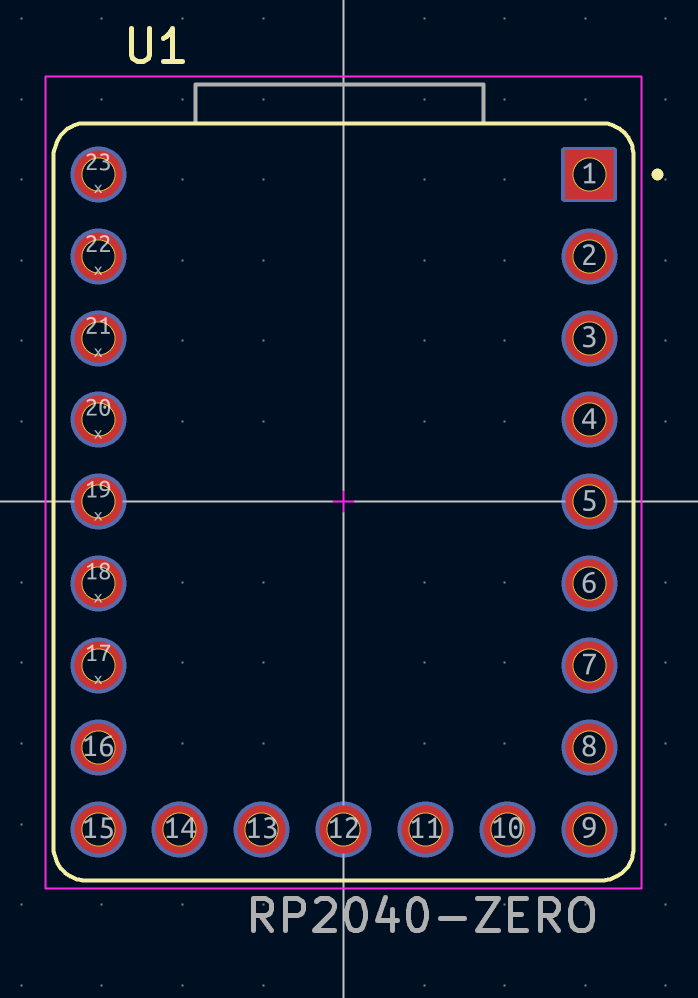
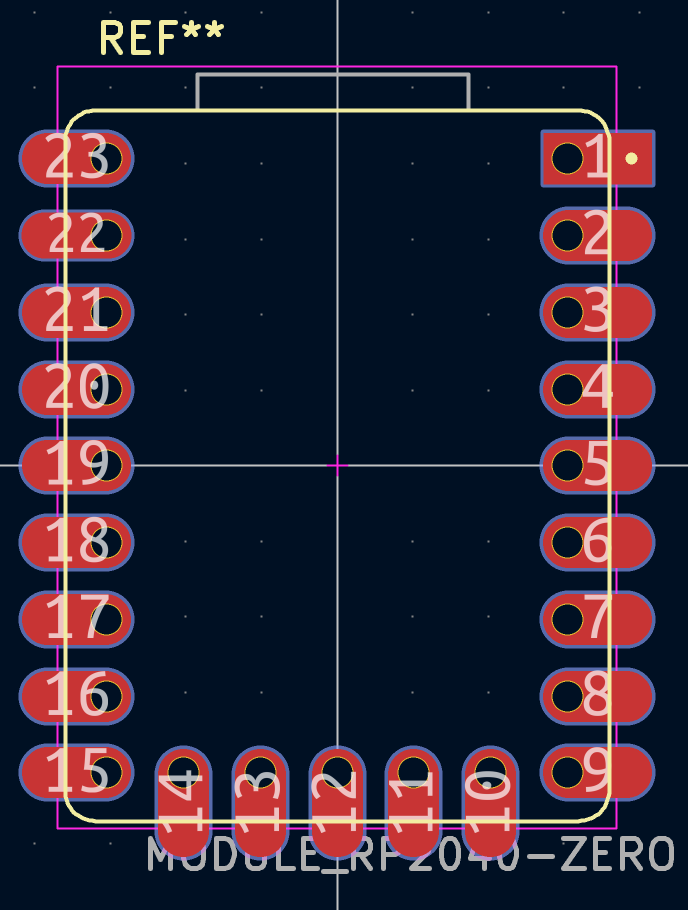

# June 24: Made the schematic and PCB

So I explored the guide and decided how I wanted my PCB to be: a mixture of a tray mount and a plateless mount keyboard that supports stenography, which I want to try out, and also supports the QWERTY 

Schematic:

and I made the PCB:

Here is the beautiful 3d render of PCB:

**Total time spent: 7 hrs**

# June 24: Manually routed the board cleanly

So I found out that auto routing is not allowed so I manually routed everything and I made it cleanly. I had to modify the pinout, which GPIO pins are connected to which, because as I exchanged that I made the routing even cleaner. In the middle I remembered that I can use 2 layers. As I remembered that, I made my routing very beautiful and very good. Now my PCB looks great. I love it 

.png)

**Total time spent: 3.6 hrs**

# June 25 : Fixed up the routing and all(again) and made Case and Firmware

Today was a really productive day. I decided that I am not going to use other things for the main dev board but rather I'll just directly solder it on through the castellated edges...

Old Footprint:

New footprint:

and I had to re-route as pads became larger:

and I made the case in onshape(the holes at bottom are purposeful, they will help me verify if soldering is still fine if something breaks...):

And the 3d view of my finished keyboard!:

and I also made the firmware with QMK

**Total time spent: 8 hrs**
