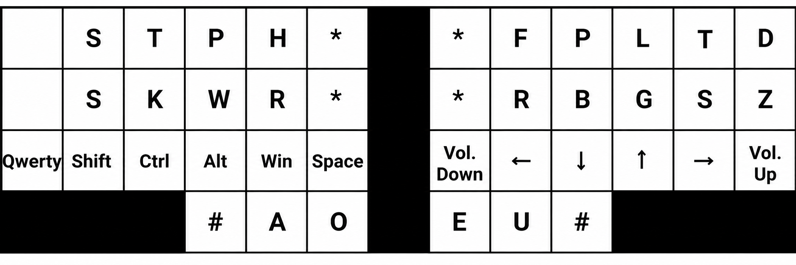
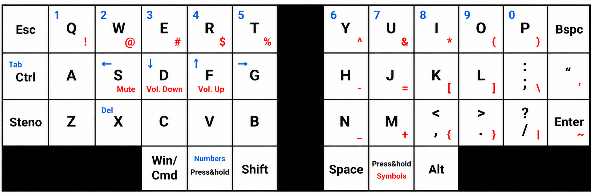
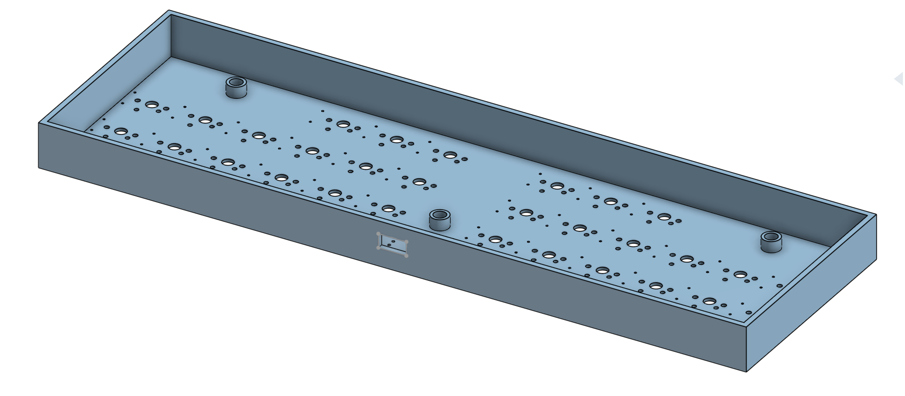
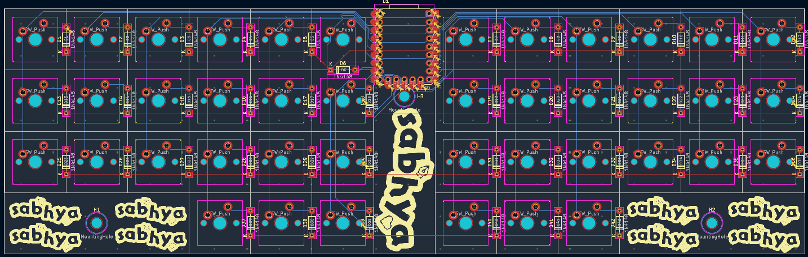

# Polyglot-Keyboard
This is a keyboard made by me that can change between stenography mode and QWERTY mode. It is basically a cheaper version of the [Polyglot Keyboard by Steno Keyboards](https://stenokeyboards.com/products/polyglot-keyboard). It uses the QMK Firmware. The PCB was made in KiCad. The case was designed in OnShape. It is quite effective and also very beautiful. The design and shape are customised for my personal use...

## BOM

|Name                 |Description                                                                                 |Quantity|Total Cost|Link                                                                                                                               |Distributor|
|---------------------|--------------------------------------------------------------------------------------------|--------|----------|-----------------------------------------------------------------------------------------------------------------------------------|-----------|
|PCB                  |Main PCB(includes payment fee)                                                              |1       |$1.36     |https://aivon.com/                                                                                                                 |AIVON      |
|RP2040 Zero          |Main Dev Board(cost includes shipping)                                                      |1       |$4.73     |https://robu.in/product/waveshare-rp2040-zero-without-header/                                                                      |robu       |
|MX Switches          |MX switches(pack of 10 and 4 of them = 40 keys and rest 2 keys given by another HackClubber)|4       |$2.86     |https://meckeys.com/shop/accessories/keyboard-accessories/key-switches/regular-switch-3pin/?attribute_pa_key-switches=regular-black|meckeys    |
|Keycaps              |Blank Keycaps(pack of 5)                                                                    |9       |$8.58     |https://meckeys.com/shop/accessories/keyboard-accessories/keycaps/blank/blank-dsa-keycaps-1u/?attribute_pa_variations=black        |meckeys    |
|1N4148 Diode         |1N4148 Diode(price not include shipping as shipping is shared with the RP2040 Zero)         |42      |$0.55     |https://robu.in/product/1n4148-1w-zener-diode-pack-of-50/                                                                          |robu       |
|M3x3mm Heatset Insert|M3 X 3mm Brass Threaded Inserts(includes shipping cost)                                     |3       |$0.81     |https://onlyscrews.in/products/m3-x-3mm-brass-threaded-inserts?variant=49729062273337                                              |onlyscrews |
|M3x5mm Screws        |Screws(shipping grouped with inserts)                                                       |3       |$0.05     |https://onlyscrews.in/products/m3-x-5mm-phillips-pan-head-ss-304-screw-dia-3mm-length-5mm?variant=50614141059385                   |onlyscrews |

## Images

### Keymap in Stenography mode

### Keymap in QWERTY mode

### 3D Render of the  assembled keyboard

### Case

### PCB Schematic

### PCB Design

### PCB 3D Render

.png)
